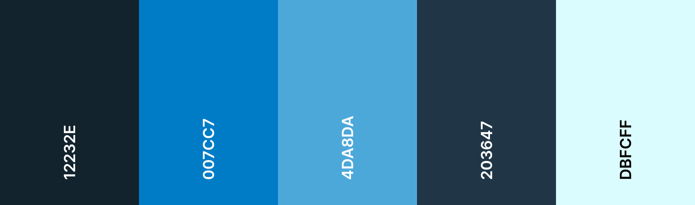
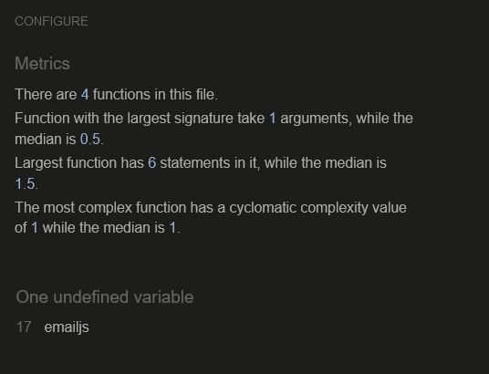

# Under the Sea

## Table of Content
1. [Project overview](#project-overview)
2. [User Experience](#user-experience)
    1. [Target Audience](#target-audience)
    2. [User expectations](#user-expectations)
    3. [User stories](#user-stories)
3. [Design](#design)
    1. [Colour](#colour)
    2. [Fonts](#fonts)
    3. [Structure](#structure)
    4. [Wireframes](#wireframes)
4. [Features](#features)
5. [Testing](#testing)
    1. [Validation](#validation)
    	1. [HTML validation](#html-validation)
        2. [CSS validation](#css-validation)
        3. [Accessibility](#accessibility)
        4. [JavaScript](#javascript)
        5. [Performance](#performance)
    2. [Browser compatibility](#browser-compatibility)
    3. [Responsiveness](#responsiveness)
    4. [Testing user stories](#testing-user-stories)
    5. [Further testing](#further-testing)
    6. [Bugs](#bugs)
6. [Deployment](#deployment)
7. [Technologies used](#technologies-used)
8. [Credits](#credits)
9. [Acknowledgements](#acknowledgements)

## Project overview
Project 2 for Code Institute Full-stack development program: JavaScript Essentials.

View the [Live site](https://michelleconville.github.io/under-the-sea/)

## User experience

### Target Audience
This game was designed for both children and adults in mind
*   For children who may just want to find the matching pairs
*   For adults who may want to challenge themselves and attempt to beat their own time and moves on each game

### User expectations 
*   User-friendly and intuitive to navigation
*   Fast site performance
*   Accessible to all users
*   Responsive across devices

### User stories
#### Users
1.	I want to test my memory skill in a fun environment
2.	I want to see how long it takes me to complete the challenge
3.	I want to see the number of moves it takes me to complete the challenge
4.	I want to be able to reset the game at any time
5.	I want to receive a notification what the game is complete

#### Site owner
6.	I want users to be able to contact us
7.  I want users to understand the game

## Design
### Colour
The colour scheme was chosen to tie in with the under the sea theme, with the different shades of blue.

Light Cian is used throughout the site, mainly on the navigation bar and the font colour. Gunmetal is use for the game cards and the buttons. The other colours are sprinkled througout the website.

### Fonts
The fonts used are Montserrat and Hind. 
Montserrat is used for the logo and the headers and Hind for the rest of the website. 
Fonts were imported from [Google Fonts](https://fonts.google.com/). The backup font of sans-serif was used in case the fonts do not load for the user.

### Structure
The *Under the Sea* website is structured in a user friendly and easy to learn way. Upon arriving to the website, the user sees a navigation bar with the logo on the left-hand side and the navigation links to the right. The navigation bar is located on all pages created.

The website consists of 3 pages:
*   The homepage 

This page displays the game, the time and moves counters sit above the game and the restart button to resrart the games sits under it

A rules modal can be located from the homepage in the navigation bar

When the game is completed a finish modal displays

*   The Contact page

This page displays a contact form

A thank you page when a user completes the contact us form and 404 page are also available.

*   The 404 page

This page allows the user know something has gone wrong, there is a button that re-directs the user to the main page.

### Wireframes

Homepage

 

Contact

Rules

404 error

## Features 
### Site wide

All site wide features will be fully responsive on all devices.

#### Navigation bar
*   This will contain the website name and links to the Home, Rules and Contact pages and will be responsive on all devices. 
    *   The website name will be linked to the landing page for ease of use for the user, no matter what page the user is on, by clicking on the name, the user will be brought back to the landing page.
*   This will allow users to easily navigate between the pages within the site on any size device.

#### Favicon
*   A site wide favicon will be implemented with a blue fish icon for the *Under the Sea* site.
*   This will provide an image in the tabs header to allow the user to easily identify the website if they have multiple tabs open.

#### 404 page
*   A 404 page will be implemented and will display if a user navigates to a broken link.
*   The 404 page will allow the user to easily navigate back to the main website if they direct to a broken link / missing page, without the need of the browsers back button.

### Landing page

#### Memory game cards
*   The memory game card layout will be using a 4x4 style grid, with a total of 16 cards.
*   User stories covered: 1

#### Timer and Move counters 
*   Timer and move counters will be on the landing page above the game 
*   The game timer will be activated once the user flips the first card, the moves tracker will start when the second card has been flipped over, the moves tracker will count each match attempted.
*   User stories covered: 2 and 3

#### Restart button
*   A restart button will be on the landing page under the game that when clicked will reset the game.
*   The restart button, resets the game, when it is pressed the game turns any face-up cards back over, reshuffles them and resets the time and moves counter back to 0.
*   User stories covered: 4

#### Rules modal
*   In the navigation bar and rules modal will be located
*   The rules modal will explain how to play the game. A play button will be included on the modal to bring the user back to the game
*   User stories covered: 7

#### Finish modal
*   Once the game is completed a finish modal will appear
*   The finsh modal will indicate the game is over, it will let the user know how many moves and the total time to complete the game. A play again button will be included on the modal to bring the user back to the game.
*   User stories covered: 2, 3, 5

### Contact page
#### Contact form
*   The contact page will have a contact form to all users to give feedback. The form will have the follow fields
    *   Name
    *   Email Address
    *   Text field for the message
    *   Send email button
    *   Paly Again! button

*   This will allow the user to provide feedback if they have any questions or suggestions. The play again button will allow the user be brought back to the gameS
*   User stories covered: 6

#### Thank-you message
*   On successful submission of the contact form, the user will be navigated to thank-you page displaying a thank you message.
*   This will allow the user to know their message has been received. 

### Future features to be implemented
*   Scoreboard

The ability for users to track their scores

## Testing

### Validation

#### HTML validation

The W3C Markup Validation Service was used to validate the HTML of the website. All pages pass with no errors no warnings to show.

Landing page

Contact page

404 page

#### CSS validation

The W3C Jigsaw CSS Validation Service was used to validate the CSS of the website.

Whole site

### JavaScript

JSHint Static Code Analysis Tool for JavaScript was used to validate the Javascript files. No significant issues were found.

script.js

form.js

#### Accessibility

NEEDS TO BE ADDED

#### Performance

Google Lighthouse in Google Chrome Developer Tools was used to test the performance of the website.

Landing page

Contact page

404 page

### Browser compatibility
The website was tested on the following browsers:

*   Google Chrome
*   Mozilla Firefox
*   Microsoft Edge

### Responsiveness
All pages were tested to ensure responsiveness on screen sizes from 320px and upwards on the following browsers and devices

#### Browsers
*   Google Chrome
*   Mozilla Firefox
*   Microsoft Edge

#### Devices
*   iPhone SE
*   OnePlus Nord
*   Dell laptop

In addition to the above listed devices, the Google Chrome Developer Tools device toggling option for all available devices was used.

### Testing user stories
**First time users**

1. I want to test my memory skill in a fun environment

| Feature         | Action                                                         | Expected result                 | Actual Result     |
|-----------------|----------------------------------------------------------------|---------------------------------|-------------------|
| Memory game cards | On landing page click on the cards to play the game | Game starts | Works as expected |

2.  I want to see how long it takes me to complete the challenge

| Feature               | Action                                                           | Expected result                                | Actual Result     |
|-----------------------|------------------------------------------------------------------|------------------------------------------------|-------------------|
| Timer counter  | On landing page click on a card to start the game timer  | Timer counter starts  |  Works as expected |
| Finish modal | On landing page, find all matching cards | On landing page, find all matching cards | Works as expected |

3.  I want to see the number of moves it takes me to complete the challenge

| Feature               | Action                                                           | Expected result                                | Actual Result     |
|-----------------------|------------------------------------------------------------------|------------------------------------------------|-------------------|
| Moves counter  | On landing page flip over two cards to start the moves counter | Moves counter starts |      Works as expected |
| Finish modal | On landing page, find all matching cards | Finish modal appears with total number of moves | Works as expected |

4. I want to be able to reset the game at any time

| Feature         | Action                                                         | Expected result                 | Actual Result     |
|-----------------|----------------------------------------------------------------|---------------------------------|-------------------|
| Restart button | On landing page, once the game has started, select the restart button | Cards, timer and moves counter are reset | Works as expected |

5. I want to receive a notification what the game is complete

| Feature         | Action                                                         | Expected result                 | Actual Result     |
|-----------------|----------------------------------------------------------------|---------------------------------|-------------------|
| Finish modal | On landing page, find all matching cards | Finish modal appears |         Works as expected |

**Site owner**

6. I want users to be able to contact us

| Feature         | Action                                                         | Expected result                 | Actual Result     |
|-----------------|----------------------------------------------------------------|---------------------------------|-------------------|
| Contact page | On landing page click on the Contact link in the Navigation bar | Data submitted via contact form | Works as expected |

7. I want users to understand the game

| Feature         | Action                                                         | Expected result                 | Actual Result     |
|-----------------|----------------------------------------------------------------|---------------------------------|-------------------|
| Rules modal | On landing page click on the Rules link in the Navigation bar | Modal opens as expected | Works as expected |

### Further testing
Asked friends and family to look at the site on their devices and report any issues they came found.

### Bugs

| **Bugs**                                                     | **Fix**                                                    |
|--------------------------------------------------------------|----------------------------------------------------------- |
| Button spacing on contact form            | Add padding to the game-btn class in the media query in the CSS file          |
| Navigation bar not working correctly on contact page          | Remove bootstrape and use css to format the form          |
| Click to Start overlay appearing after selecting the restart button | add an addEventListener and create a ready function |
| Colour contrast failed on Timer and Moves counter | Change the colour from white to black                                 |
| HTML error - Section lacks heading | Remove section tags and add an additional div tags                                   |

## Deployment
### Project creation
This project was created by using the [Code Institute Template](https://github.com/Code-Institute-Org/gitpod-full-template) in github. Gitpod was used to write the code and push the code to repository created in github.

The git commands I used to push the code from gitpod to github were

`git add .` - This command was used to add the file(s) to the staging area before they are committed.

`git commit -m “commit message”` - This command was used to commit changes to the local repository queue ready for the final step.

`git push` - This command was used to push all committed code to the remote repository on github.

### Deployment to github pages
The site was deployed to GitHub pages. The steps to deploy are as follows:
*   In the GitHub repository, navigate to the Settings tab
*   From the menu on left select *pages*
*   From the source section drop-down menu, select the Branch: main
*   Click the *save* button
*   A live link will be displayed in a green banner when published successfully.

View the [Live site](https://michelleconville.github.io/under-the-sea/)

### Clone the repository
The steps to clone a repository are as follows:
1.	Navigate to the GitHub repository you would like to clone
2.	Click on the code drop down button
3.	Click on the HTTPS tab
4.	Copy the repository link to the clipboard
5.	Open Git Bash
6.	Change the current working directory to the one where you want the cloned directory
7.	Type git clone and then paste the URL from the clipboard 

    `git clone https://github.com/michelleconville/under-the-sea.git`
8.	Press Enter to create your local clone.

The repository will now be cloned on your local machine for use.

## Technologies used
**Languages used**

*   HTML - The structure of the Website was developed using HTML as the main language.
*   CSS - The website was styled using custom CSS in an external file.
*   JavaSrcipt - The game play logic was created using JavaScript in an external file.

**Programs used**
*   GitHub - Source code is hosted on GitHub and deployed using Git Pages.
*   Gitpod - Used to commit and push code during the development of the website
*   Font Awesome - Icons were obtained from [Font Awesome](https://fontawesome.com/) and used for logo image and the social media icons in the footer.
*   Photoshop - Images used throughout the website were modified using Adobe Photoshop
*   Favicon.io - The favicon files were created at https://favicon.io/favicon-converter/
*   Balsamiq - Wireframes were created using Balsamiq
*   Techsini.com - Used to generate the website mock-ups
*   EmailJs - Used tosend emails from the website

## Credits

### Media
*   Animated sea animals images were cropped from freepik.com image

### Code
*   [youtube](https://www.youtube.com/watch?v=28VfzEiJgy4) inspiration was taken from this tutorial.
*   [Marina Ferreira tutorial](https://marina-ferreira.github.io/tutorials/js/memory-game/) was followed and some JavaScript code was taken and adapted to my game.
*   W3 Schools was used as a reference point for HTML, CSS and JavaScript
*   MDN Web Docs was also used as a reference point for HTML, CSS and JavaScript
*   [stackoverflow](https://stackoverflow.com/) was used to troubleshoot issues I came across

### Other resources used
*   [kubowania](https://github.com/kubowania/memory-game)
*   [taniarascia](https://github.com/taniarascia/memory)
*   [4n4ru](https://github.com/4n4ru/CI-P2-GuessingBee)
*   [moirahartigan] (https://github.com/moirahartigan/Portfolio-2---Alien-Memory-Game)

##  Acknowledgements
Special thanks to my mentor Daisy for her assistance throughout this project.